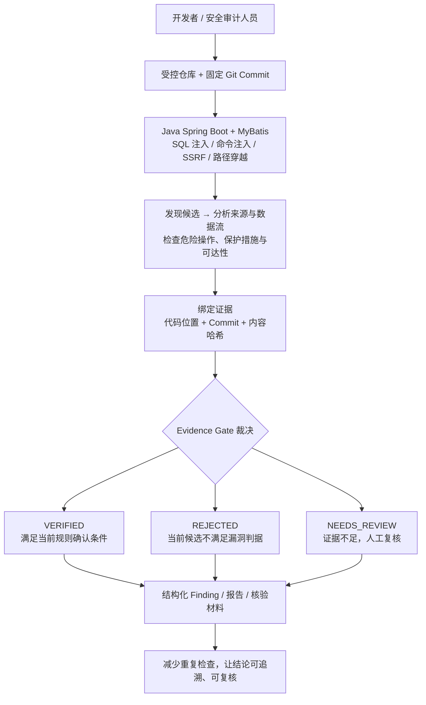
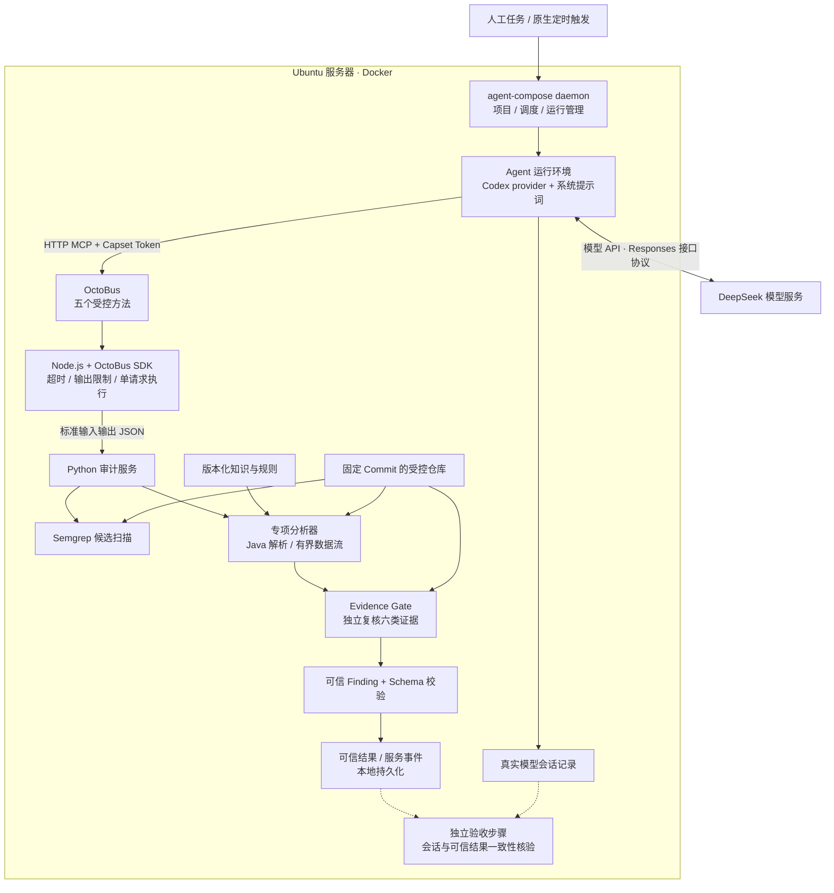

# CodeAudit Agent V1.0

**交付状态（2026-09-24）：已发布仓库，按HR反馈对齐公开访问、公钥登录与原题验收细节。最终状态见[原题逐项核对](docs/EXAM-COMPLIANCE.md)。限定场景技术测试通过不等于考核已通过。**

入口：[资源清单](docs/DELIVERY.md) · [27项要求映射](docs/REQUIREMENTS-DELIVERY-MATRIX.md) · [演示流程](docs/EXAMINER-DEMO.md) · [GitHub上传与协作](docs/GITHUB-HANDOFF.md)。

## 1. Project Overview

输入受控Git仓库和固定Commit，分析Java Spring Boot + MyBatis代码并输出Finding JSON及Markdown。需求基线：[BRD/PRD](docs/BRD-PRD.md)，原文哈希见docs/BASELINE.sha256。

## 2. Why this project

区分扫描候选、证据充分的漏洞、误报和待复核结果。成功标准是判断可验证、证据可复现，不以发现数量评估。

## 3. Architecture

大模型负责工具编排与解释，确定性程序负责分析和证据裁决。完整运行时序、开发验收流程与代码入口见[架构图与面试讲解](docs/ARCHITECTURE-WALKTHROUGH.md)；模块责任见[架构说明](docs/ARCHITECTURE.md)。

### 业务架构：从可疑代码到可复核结论



支持范围是四类风险的有限静态模式；拒绝某个候选或没有扫描结果，都不代表整个项目安全。

### 技术架构：模型编排与证据裁决分工



虚线表示验收时读取材料，不表示定时任务结束后已自动执行验收。JSON/Markdown 报告由报告模块及 CLI/验收流程生成，模型最终响应按契约输出 JSON。模型品牌与 Codex provider 是两个不同概念。

## 4. Supported vulnerabilities

支持SQL Injection、Command Injection、SSRF、Path Traversal的限定静态场景。未知语法、动态分派、未知保护保持NEEDS_REVIEW。TC-05和TC-10采用用户确认勘误，见docs/PHASE8-COMMAND-ERRATUM.md、PHASE8-PATH-ERRATUM.md。

## 5. LLM vs Deterministic Boundary

模型仅规划、调用和解释。VERIFIED必须满足Source、Dataflow、Sink、Protection、Reachability、Evidence Integrity六类证据。Gate独立重新读取和验证；Schema不能代替Gate。模型会话结果必须与实际工具及可信记录一致。

## 6. Installation

推荐Linux、Python 3.9+、Git；容器已在Python 3.11验证。Java Demo另需Java17和Maven；真实模型链路另需Docker、OctoBus、Agent Compose及模型凭据。

```bash
python3 -m venv .venv
. .venv/bin/activate
python -m pip install -r requirements-dev.txt
python -m pip install -e .
python -m pytest -q
```

2026-09-23对发布版本重新执行核心回归：121项通过。服务器另有12项案例与真实调用证据。当前四个边界问题未修复，见本页Known Limitations。

## 7. Configuration

`.env.example`仅提供空模板。根目录agent-compose.yml为通用模板，不是服务器实际私有配置。真实凭据不进入Git。

- 应用agent/，规则rules/semgrep/，知识knowledge/java-spring/。
- 服务octobus/code-audit-service/，模型受限运行镜像deploy/guest/。
- 服务镜像deploy/local/Dockerfile；服务器恢复定义deploy/server/compose.yml。
- 当前服务器前提与运行信息见[服务器验收](docs/PHASE10-SERVER-ACCEPTANCE.md)。

## 8. Run

确定性12项验收无需模型，输出目录必须不存在：

```bash
PYTHONPATH=. python scripts/run_acceptance_matrix.py --output runs/acceptance-new
```

此命令生成固定提交、Semgrep扫描、Finding及matrix.json，不代替模型链路验收。单仓库审计：

```bash
python -m agent.cli audit --repository /approved/repo \
  --commit FULL_COMMIT_SHA --rules rules/semgrep --output runs/audit-new
```

替换为实际受控路径及完整Commit。真实服务器调用见[演示流程](docs/EXAMINER-DEMO.md)。

## 9. Demo

fixtures/spring-security-lab为隔离演示工程。Demo以本仓库目录及历史提交Git bundle交付，可离线克隆；不依赖另一个尚未发布的仓库。

```bash
cd fixtures/spring-security-lab
mvn -B package
java -jar target/spring-security-lab-1.0.0.jar
```

仅在隔离环境运行。默认回环监听；服务器容器非root、无外部网络、根文件系统只读。已实际构建运行并验证三个HTTP检查，不代表每个静态样例均已运行时利用。

## 10. Finding Format

schemas/finding.schema.json规定VERIFIED、NEEDS_REVIEW、REJECTED三种状态，无主观可信度分数。评审包中的evidence/review/cases/保留完整Finding；evidence/review/report/包含由真实Finding生成的JSON/Markdown。

## 11. Knowledge Base

knowledge/java-spring/记录通用保护与误报规则。结果记录rules_applied、knowledge_version和decision_trace。TC-12对照验证知识开关产生的结果变化；field-notes不冒充个人客户经历。

## 12. Test Cases

tests/functional/为测试入口，12案例见docs/ACCEPTANCE-MATRIX.md。精选发布证据在evidence/review/；原始会话和私有配置由所有者保管。runs/不提交Git。

## 13. Security Design

限制仓库根目录和Commit；拒绝路径越界；固定扫描参数；不执行目标仓库脚本。Agent仅获得五个受控方法。模型密钥、Capset Token、服务器私钥、私有配置不得公开。GitHub和SSH权限分开管理，不向考官共享root私钥。

## 14. Troubleshooting

见[故障复盘](docs/TROUBLESHOOTING.md)。退出0不等于真实工具执行完成，扫描失败不得写“无漏洞”。必须核对实际调用、候选覆盖、可信结果一致性。

## 15. Known Limitations

- 非通用Java全程序分析器，复杂动态调用、未知过滤保持待复核；未覆盖的API可能不产生候选，零结果不等于证明项目无漏洞。
- 已知未修复：零候选Agent会话校验拒绝；额外上下文读取可能被拒绝；JDBC候选可能被错分为命令类；无关Java record语法可能使分析退化。固定SQL演示不代表这些边界已解决。
- Path真实路径边界依赖可信目录及无并发文件系统篡改，不宣称消除TOCTOU。
- SSRF映射不替代DNS、重定向与出口网络检查。
- 工具限制不等于容器逃逸安全证明。
- BRD示例Instance为java-audit-instance，实际验收ID为code-audit-local；五方法功能已验证，名称差异需在评审中确认。

## 考官登录与现场核验

仓库：https://github.com/m13756445700-lgtm/codeaudit-agent

| 项目 | 值 |
|---|---|
| 服务器地址 | `8.130.121.3` |
| SSH用户名 | `codeaudit-reviewer` |
| SSH端口 | `22` |
| 认证方式 | HR提供的ED25519公钥已写入该账号authorized_keys；私钥由考官自行保管 |
| 公钥指纹 | `SHA256:w59gf6u379xQnpdNqYMxtb/MNs4+gvKeG02A1o1B0m4` |
| 评审资料 | `/srv/codeaudit-review/codeaudit-agent` |

```sh
ssh -p 22 codeaudit-reviewer@8.130.121.3
sudo codeaudit-review status
sudo codeaudit-review projects
sudo codeaudit-review triggers
sudo codeaudit-review runs
sudo codeaudit-review methods
cd /srv/codeaudit-review/codeaudit-agent
```

公钥只配置到服务器，不作为GitHub密钥上传。评审账号无通用sudo及Docker组权限，以上固定入口用于查看实时状态；运行新模型审计由所有者操作。原生调度每天北京时间13:46（UTC 05:46）审计固定Demo提交，使用现有模型额度，评审后由所有者关闭。2026-09-24第二次自动运行严格会话校验通过，首次失败摘要保留。命令实测和自动触发记录见[验收核对](docs/EXAM-COMPLIANCE.md)。

待考官确认：使用自身私钥登录成功、出口公网IP/网段、面试时间。来源IP未提供，因此“仅考官来源开放SSH”尚未完成核验，不能标为通过。服务器需保持在线至面试结束。

原始考题是工程交付与评定依据；BRD为本项目自拟功能规格，不能替代原题。答辩按原题约30分钟，见[答辩提纲](docs/DEFENSE-30MIN.md)。
