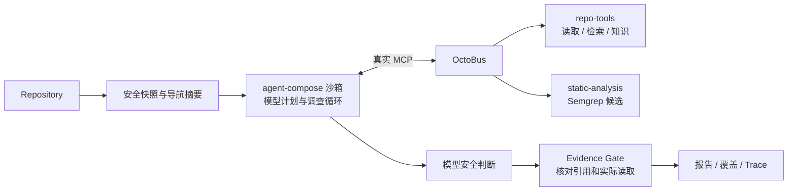

# CodeAudit Agent V2

Evidence-driven Agentic Code Security Audit System：从 Git、ZIP 或本地代码快照出发，由模型理解攻击面、制定计划、动态调用工具、调查假设并作出有证据的安全判断。它帮助审计人员把可疑代码追溯到输入、传播、保护条件和安全边界，而不是仅对扫描器结果生成摘要。


```mermaid
flowchart LR
  R[Repository] --> I[安全快照与导航摘要]
  I --> A[agent-compose 沙箱\n模型计划与调查循环]
  A <-->|真实 MCP| O[OctoBus]
  O --> T[repo-tools\n读取 / 检索 / 知识]
  O --> S[static-analysis\nSemgrep 候选]
  A --> J[模型安全判断]
  J --> G[Evidence Gate\n核对引用和实际读取]
  G --> F[报告 / 覆盖 / Trace]
```

模型负责调查方向和安全语义；确定性工具负责获取事实和校验。即使 Semgrep 无候选，模型也可提出跨文件假设；工具不会替模型确认漏洞。Gate 只能拒绝或降级证据不完整的判断，不能把未知提升为确认。

## 考官连接与提交信息

公开仓库：[CodeAudit Agent V2](https://github.com/m13756445700-lgtm/codeaudit-agent)，提交分支 `main`。

服务器：`8.130.121.3`；用户名：`codeaudit-reviewer`；SSH 端口：`22`。考官提供的公钥已安装在该账户的 `authorized_keys`，请使用对应私钥登录：

```bash
ssh -p 22 -i /path/to/examiner_private_key codeaudit-reviewer@8.130.121.3
```

私钥由考官自行保管，不需要上传到 GitHub 或服务器。模型密钥与内部服务令牌仅留在服务器私密配置中。登录后使用以下受限入口，无需 root 或 Docker 权限：

```bash
sudo codeaudit-review status
sudo codeaudit-review projects
sudo codeaudit-review triggers
sudo codeaudit-review methods
sudo codeaudit-review runs
sudo codeaudit-review report
sudo codeaudit-review trigger
# 也可审计新的公开仓库
sudo codeaudit-review audit https://github.com/OWNER/REPO.git
```

`trigger` 启动同一个 V2 Engine；每日北京时间 09:00 的定时任务审计随镜像固定的跨文件回归仓库。报告含真实 MCP 调用、模型判断、覆盖与限制；没有完成记录时明确报错。`report AUDIT_ID` 可选取历史记录。服务器当前部署目录 `/opt/codeaudit-v2`；私密配置不可供考官读取。

## Quick Start

需要 Docker Engine/Desktop、Docker Compose v2（支持 `volume.subpath`）、Python 3.9+、Git，以及支持 tools/function calling 的 OpenAI-compatible Chat Completions 模型。建议 4 CPU、8 GiB RAM，预留 15 GiB Docker 磁盘空间；首次构建需要访问 GHCR、Debian、PyPI 和 npm。

```bash
cp .env.example .env
# 编辑 .env：LLM_API_ENDPOINT、LLM_MODEL、LLM_API_KEY
./scripts/start.sh
./scripts/healthcheck.sh
./scripts/demo.sh c
```

`start.sh` 从固定 digest 的公开镜像构建，创建本项目独立 daemon/数据卷，生成私密鉴权配置，启动三个能力服务，注册 OctoBus，再配置 agent-compose。无需预装另一套 agent-compose 或准备旧数据卷。首次下载可能较慢。[Ubuntu 部署、端口和恢复](docs/DEPLOYMENT.md)。

## CLI 与输入

```bash
# 容器作业：真实 OctoBus，直接给 Repository
# 启动脚本已生成 .runtime.env；两个 env 文件均只留本地。
docker compose --env-file .env --env-file .runtime.env run --rm codeaudit-agent \
  https://github.com/miguelgrinberg/flask-video-streaming.git --keep-source

# 完整 agent-compose 沙箱链路；参数 a/b/c/d 或任意 Git URL
./scripts/demo.sh https://github.com/miguelgrinberg/flask-video-streaming.git

# 本地源码或 ZIP：显式挂载后输入容器内路径
docker compose --env-file .env --env-file .runtime.env run --rm \
  -v "$PWD/benchmark:/input:ro" codeaudit-agent /input/cross-file-flow --keep-source
```

包入口是 `codeaudit <repository>`，也接受 `codeaudit audit <repository>`。支持 Git HTTPS/SSH、本地目录、ZIP；每次生成独立 UUID 快照。私有 Git 需显式提供容器内凭据/known_hosts；不自动复制主机私钥。目标代码不执行，拒绝路径穿越和符号链接，限制 50 MiB、5,000 文件、单文件 1 MiB、Git 获取 90 秒。

直接安装开发入口可用 `pip install -e .`（Semgrep 1.99.0 另装）；正式演示使用上述容器链路。`--local-tools` 是显式开发适配器，不算 OctoBus 验收。模型配置缺失或 MCP 失效不会静态兜底伪装成功。

## Audit Loop 与职责

1. Intake 生成快照、哈希及词法导航摘要。
2. 模型提交攻击面/计划，自行选择读取、搜索、知识或静态扫描动作。
3. 模型建立假设，追踪 Source → Dataflow → Sink，调查保护逻辑和反证。
4. AI Judge 提交控制范围、安全边界、可达性、攻击条件、严重度、置信依据、未知事实和修复建议。
5. Gate 核对实际读记录、文件哈希、行号和字面证据；模型继续补证或完成调查。
6. 输出 `report.md`、`findings.json`、`coverage.json`、计划、模型调用及工具 Trace。

`COMPLETE` 仅表示计划攻击面已逐项结算的有界调查结束；明确延期的攻击面产生 `PARTIAL`，预算或执行失败产生 `INCOMPLETE`。必须同时查看未读文件和未知事实，不能解释成整个仓库安全。

agent-compose 真正创建 Docker 沙箱并执行 Python Engine；`provider: codex` 是运行配置，不意味着另一个 Codex 模型替 Engine 裁决。Engine 使用 `.env` 中指定的模型。OctoBus 通过真实 MCP 鉴权/能力路由调用两个内部 HTTP worker；不是空配置或截图占位。[架构详解](docs/ARCHITECTURE.md)。

## Test 与 AI Ablation

```bash
make docker-test          # Linux 离线单元/集成契约/工具/证据/输入/基线回归
make integration-test     # 真实模型 + OctoBus，需 API 配额
make ablation-test        # 同一快照的完整静态分析 vs 真实 AI
make benchmark           # 全部 20 例；重新调用模型，需更多配额
make private-git-test     # 临时 SSH Git 容器；主机 Python 可直接运行
```

公平消融保留原有 Java/MyBatis 确定性分析、Evidence Gate 和修复建议，只用快照哈希适配原 Git/framework 预检。静态侧不被人为置零。生产 Engine 不导入静态 baseline；这些模块保留是为了可复核的评估，不提供旧服务/旧审计 CLI。

历史 REV 的固定 20 例结果为 TP10/FP0/FN0，9 个正例无静态候选；静态结果为 3 个 NEEDS_REVIEW、0 VERIFIED。它们只描述该固定小样本，不代表任意项目准确率。清理后的最新验证见 [交付与验证清单](RELEASE_MANIFEST.md)。

## Demo 与工程目录

`./scripts/demo.sh a`：直接 SQL 注入；`b`：固定映射安全案例；`c`：三文件命令链；`d`：非基准公共仓库。默认运行 C，所有演示走真实 agent-compose。D 没有完整人工真值，不计算 Recall；也可现场换一个未接触的 Git URL。[现场步骤及证据导出](docs/DEMO.md)。

```text
agent/v2/             模型循环、输入、证据、工具与 MCP
agent/scanner/        受限 Semgrep
agent/*.py            保留的确定性评估依赖（analysis/report 等）
knowledge/ rules/     判断知识与静态规则
benchmark/ fixtures/  20 例真值与基线测试夹具
scripts/ tests/       部署、演示、验收与回归
octobus/repo-tools/   真实 SDK 能力桥
Dockerfile            单一可独立构建镜像
docker-compose.yml    本项目服务及 daemon
agent-compose.yml     审计沙箱定义
docs/                 架构、部署、演示、安全
```

## Known Limitations

这是可信单操作者的辅助审计系统，不是多租户平台。多语言词法导航不等于完整调用图；模型可误判、漏判，部署和第三方依赖事实可能未知。固定规则主要覆盖 Java/Spring/MyBatis 及有限模式；Python/JS/Go 的样例通过不等于完整语言语义支持。20 个人工样例、单次知识 ON/OFF 和公共示例不足以证明普遍准确率。超限可能失败或 `INCOMPLETE`；不执行漏洞利用。报告和原始证据可能包含私有源码，应按敏感数据保存。[安全边界](docs/SECURITY.md)。

整改过程、实际遇到的问题与验证边界见 [提交整改记录](docs/REMEDIATION.md)。
