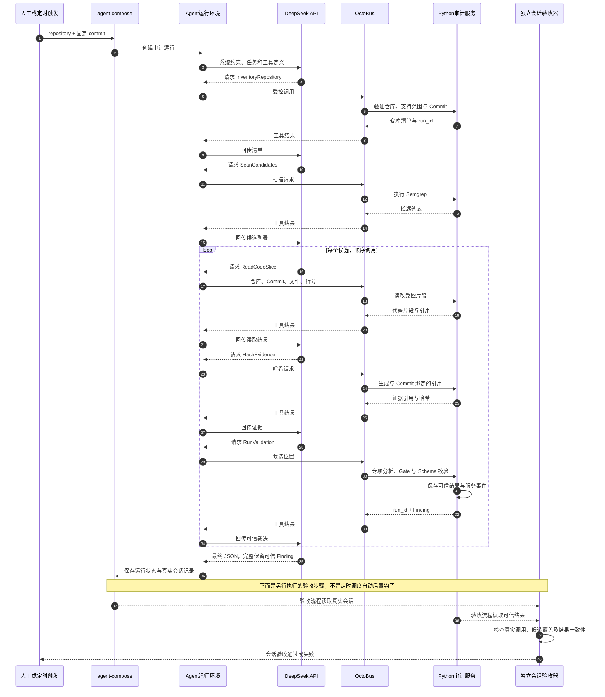
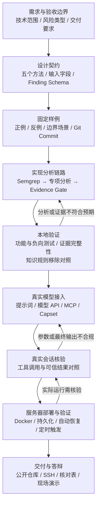

# 架构图与面试讲解

按 2026-09-24 已交付实现整理。业务架构与技术架构见 [README](../README.md#3-architecture)。本文补充完整运行时序、开发验收流程及可核对的代码入口。

## 1. 项目定位与讲解顺序

CodeAudit Agent 面向 Java Spring Boot + MyBatis 的受控代码审计。大模型负责调用工具、组织流程与解释结果；确定性程序负责专项分析和证据裁决，再以真实会话记录核验审计过程。

建议在原题的 30 分钟答辩中这样使用材料：

| 时间段 | 展示内容 | 要说明的问题 |
|---|---|---|
| 整体设计 5 分钟 | README 业务架构 | 输入、业务范围、交付价值与限制 |
| 架构 10 分钟 | README 技术架构 + 下方时序 | 模型、运行平台、工具服务和 Gate 如何协作 |
| 知识 10 分钟 | 规则、正反例、移除规则对照 | 知识如何实际影响判定，证据在哪里 |
| 复盘 5 分钟 | 开发流程 + 真实失败案例 | 如何验证、如何定位问题、已知限制 |

## 2. 一次审计的完整时序

图展示正常路径。工具鉴权失败、参数错误、超时、仓库变化或输出不合规，均不能被包装成审计成功；模型最终文本也不能替代工具证据。当前会话验收对额外上下文读取较严格，这是已披露限制。

### 模型 API 与五方法契约

- 当前部署使用 DeepSeek 和 Responses 接口协议；Codex 是配置中的 provider，不等于模型品牌。真实端点与密钥保留在私有运行配置。
- MCP 外层参数 `request_json` 是 JSON 字符串。Node 服务接收映射后的 `requestJson`，通过标准输入把请求交给 Python。
- `InventoryRepository`、`ScanCandidates` 使用 repository、commit；其余方法使用候选 file、line。读取片段有长度与路径边界。
- 模型不得自行修改 `RunValidation` 返回的 Finding 状态或证据。最终响应包含 repository、commit、validation_run_ids、findings。
- Schema 只校验结构；Gate 根据 Source、Dataflow、Sink、Protection、Reachability、Evidence Integrity 六类证据裁决。

### 三种事件的区别

| 事件 | 实际含义 | 当前边界 |
|---|---|---|
| 触发 | 人工任务或原生定时调度启动一次运行 | 已验证定时触发；未交付 GitHub Push/Webhook 接入 |
| 模型会话 | 模型请求工具、工具结果及最终响应 | 验收读取真实运行记录，不能用模型自述代替 |
| 服务事件 | 方法运行标识及 STARTED、SUCCEEDED 等留痕 | 错误另通过错误返回与运行记录体现，不宣称所有异常都有完整终态事件 |

当前每日固定 Demo 为北京时间 13:46。首次运行虽生成结果但严格会话核验失败；约束调用参数后，第二次自动运行通过独立核验。两次记录均保留于 [自动运行证据摘要](../evidence/review/hr-alignment/README.md)。公开摘要不等于完整原始会话。

## 3. 开发、验证、上线与交付

开发流程的反馈箭头表示定位与改进路径，不是生产环境自动修复循环。当前四项已知业务缺陷保留披露，没有因补充架构图而修复。

## 4. 技术与代码入口

| 责任 | 技术或组件 | 代码与说明 |
|---|---|---|
| 调度与 Agent 约束 | agent-compose、Codex provider、系统提示词 | [运行模板](../agent-compose.yml)、[提示词](../agent/prompts/auditor.md) |
| 能力入口 | OctoBus、HTTP MCP、Capset、Node.js SDK | [服务实现](../octobus/code-audit-service/src/main.js) |
| 受控分发与持久化 | Python、受控根目录、JSON | [服务分发](../agent/service.py) |
| 候选发现 | Semgrep 与四类规则 | [扫描器](../agent/scanner/semgrep.py)、[规则目录](../rules/semgrep/) |
| 专项分析 | Python、Java 解析、有界数据流 | [分析入口](../agent/analysis.py) |
| 知识使用 | 版本化知识、规则开关、程序执行的安全语义 | [知识加载](../agent/knowledge/loader.py)、[实践对照](PRACTICE-EVIDENCE.md) |
| 证据与裁决 | 内容哈希、Commit 绑定、独立 Gate | [证据模块](../agent/evidence/model.py)、[Gate](../agent/validator/gate.py) |
| 输出 | JSON Schema、Finding JSON、Markdown | [报告模块](../agent/report.py)、[Schema](../schemas/finding.schema.json) |
| 会话验收 | 真实调用与服务可信记录核对 | [验收器](../agent/workflow/validation.py) |
| 部署与恢复 | Ubuntu、Docker Compose、持久化卷 | [服务器恢复定义](../deploy/server/compose.yml) |

## 5. 面试时明确的边界

- 支持四类风险的有限静态场景，不是全程序通用 Java 审计。扫描不到不等于安全。
- 当前知识主要是版本化规则与开关，没有向量检索式 RAG；修改任意知识描述不会自动生成分析策略。
- 输出审计结果、证据和修复建议，没有自动修改代码、自动提交 PR 的修复闭环。
- JSON/Markdown 报告由报告模块及 CLI/验收流程生成，不能说模型定时任务必然直接生成两份文件。
- OctoBus 宿主机端口只绑定回环地址；Demo 容器无网络且只读。编排层有 Docker 权限，考官账号不具备通用 sudo 或 Docker 权限。
- 已知零候选会话、额外上下文读取、JDBC 分类和 SQL 证明边界问题见 [README 限制说明](../README.md)。考官出口 IP 与实际登录确认等交付状态见 [原题核对表](EXAM-COMPLIANCE.md)。

详细答辩安排见 [30 分钟提纲](DEFENSE-30MIN.md)。
