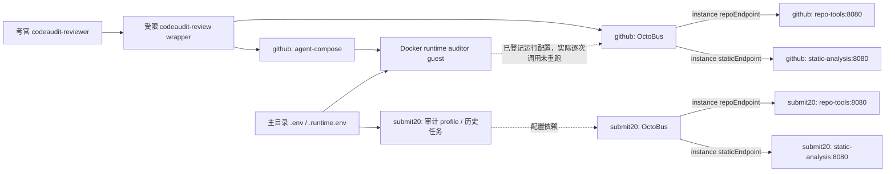
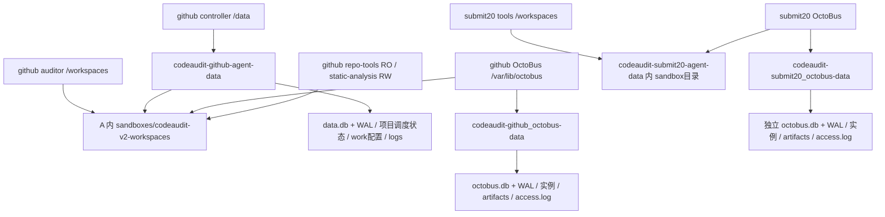

# P2-C.1 数据保护、恢复与镜像迁移评审

| 文档控制 | 内容 |
|---|---|
| 版本 / 日期 | 1.0 / 2026-10-08（Asia/Shanghai） |
| 对象 / 范围 | CodeAudit 两套运行项目；只读资产调查、方案评审及本地镜像导出 |
| 基线 | 最终 main `567a9aeed8429866c8e8cd551ddb596627bdd7ae` |
| 结论 | **P2C1_GATE=CONDITIONAL，不能放行上线** |
| 事实边界 | 已执行：只读 SSH、Docker inspect/config、实例查询、已有报告读取、本地镜像 save；未执行：生产备份、恢复、停服、镜像服务器导入、部署 |

## 1. 两套项目的技术用途与业务分类

**已验证**：`codeaudit-github` 是现有考官 wrapper 的依赖项目，controller 有已注册项目和 enabled daily-v2-audit 调度，四个常驻服务健康，存在每日历史任务。`codeaudit-submit20` 有三套独立运行的能力组件、独立网络/卷、15 份报告；其目录含 acceptance20/21/22.yml、tests/build/up/live 日志、candidate/source 和导出脚本，支持“用于迭代验收”的合理判断，但**不能据此认定业务上可删除**。它的最近样本既有 COMPLETE 也有 INCOMPLETE，均保留。

**待确认**：项目业务负责人是否将两套定义为生产、测试、演示或历史保留；是否存在外部调用者。不能把没有公网端口当成没有使用者。本轮未证明穷尽所有外部客户端和临时任务调用关系。

### 1.1 实际运行资产表

| 项目 | 容器 | ID（完整值见 JSON） | Image ID | OCI revision | 网络 | 挂载 |
|---|---|---|---|---|---|---|
| codeaudit-submit20 | codeaudit-submit20-octobus-1 | ba658d090e21 | sha256:79185994f47847bc20a4ca55a3084fd3db80a5cdb589e76577e6fe5768841fe8 | e14c4dbd5e3b0dec6178073902d67d2765390427 | codeaudit-submit20_capabilities, codeaudit-submit20_default | codeaudit-submit20-agent-data → /workspaces (RW)；codeaudit-submit20_octobus-data → /var/lib/octobus (RW) |
| codeaudit-submit20 | codeaudit-submit20-repo-tools-1 | 3e50b8c92626 | sha256:79185994f47847bc20a4ca55a3084fd3db80a5cdb589e76577e6fe5768841fe8 | e14c4dbd5e3b0dec6178073902d67d2765390427 | codeaudit-submit20_capabilities | codeaudit-submit20-agent-data → /workspaces (RO) |
| codeaudit-submit20 | codeaudit-submit20-static-analysis-1 | e4ee47ce123a | sha256:79185994f47847bc20a4ca55a3084fd3db80a5cdb589e76577e6fe5768841fe8 | e14c4dbd5e3b0dec6178073902d67d2765390427 | codeaudit-submit20_capabilities | codeaudit-submit20-agent-data → /workspaces (RW) |
| codeaudit-github | codeaudit-github-octobus-1 | ad1d3c6da248 | sha256:a56bb11d00d0763b1978e09e5c9a05fc78ebf1cf97739b61c85f885a4ede1b36 | e14c4dbd5e3b0dec6178073902d67d2765390427 | codeaudit-github_capabilities, codeaudit-github_default | codeaudit-github-agent-data → /workspaces (RW)；codeaudit-github_octobus-data → /var/lib/octobus (RW) |
| codeaudit-github | codeaudit-github-repo-tools-1 | f915be4647b5 | sha256:a56bb11d00d0763b1978e09e5c9a05fc78ebf1cf97739b61c85f885a4ede1b36 | e14c4dbd5e3b0dec6178073902d67d2765390427 | codeaudit-github_capabilities | codeaudit-github-agent-data → /workspaces (RO) |
| codeaudit-github | codeaudit-github-static-analysis-1 | abecc154f8fa | sha256:a56bb11d00d0763b1978e09e5c9a05fc78ebf1cf97739b61c85f885a4ede1b36 | e14c4dbd5e3b0dec6178073902d67d2765390427 | codeaudit-github_capabilities | codeaudit-github-agent-data → /workspaces (RW) |
| codeaudit-github | codeaudit-github-agent-compose-1 | 4cb4ed19e8e3 | sha256:3117226250256b03d25815bd1bb584ade5ac225b83f55d527be122b8b75a61e8 | e14c4dbd5e3b0dec6178073902d67d2765390427 | codeaudit-github_default | codeaudit-github-agent-data → /data (RW)；/var/run/docker.sock → /var/run/docker.sock (RW) |

完整容器 ID、状态/启动时间、ports、health、restart policy、log_path、挂载、网络 IP 见 `evaluation/final-remediation/p2-server-preflight/p2c1/inventory.json`。退出的历史 guest 也保留在 JSON，不能仅根据其 exited 状态删除。三个应用镜像的 OCI revision 是上游继承值，不能证明 CodeAudit application commit；旧 guest OCI 为 NOT_SET。

### 1.2 项目与调用关系图



两个 OctoBus 实例均通过 `instance get codeaudit-v2-tools` 确认 running、`repoEndpoint=http://repo-tools:8080`、`staticEndpoint=http://static-analysis:8080`、`workspaces=/workspaces`。这是注册配置证据，不能代替本轮真实工具调用测试。两套 capability bridge 都 internal=true；default bridge internal=false。另已从原始 Compose 的 env_file 字段核验：submit20 的 codeaudit-agent profile 直接引用 `/opt/codeaudit-v2/.env` 和 `.runtime.env`，与主项目共享模型及认证配置来源。因此两套网络/数据卷独立不代表配置完全独立；主环境文件替换、Token轮换或旧路径调整可能影响第二套后续任务。证据见 p2c1/env-sources.json。

主 daemon/MCP 分别发布 172.17.0.1:17422/19015；submit20 三个组件无 host published port。controller 挂载 Docker socket、DATA_ROOT=/data，guest 由 host sandbox 路径接入，不是第三个独立持久化项目。

### 1.3 数据路径和潜在影响



| 数据卷 | host 路径 | report 文件数 | 文件统计字节下界 | 已识别数据库 |
|---|---|---:|---:|---|
| codeaudit-github-agent-data | /var/lib/docker/volumes/codeaudit-github-agent-data/_data | 148 | 121854642 | data.db-wal, data.db-shm, data.db |
| codeaudit-github_octobus-data | /var/lib/docker/volumes/codeaudit-github_octobus-data/_data | 0 | 1480251 | octobus.db |
| codeaudit-submit20-agent-data | /var/lib/docker/volumes/codeaudit-submit20-agent-data/_data | 15 | 4017382 | 未发现 SQLite 文件头 |
| codeaudit-submit20_octobus-data | /var/lib/docker/volumes/codeaudit-submit20_octobus-data/_data | 0 | 358927 | octobus.db |

文件统计排除 .git/node_modules/.npm/.cache 子树，**不是完整磁盘占用或备份容量**。SQLite 文件通过前 16 字节识别，未连接生产数据库。三个数据库都有 WAL/SHM 相邻文件；1 秒内 mtime/size 未变化只证明该短窗口未观察到变化，不证明没有写入者。主审计根 149 个目录、148 份 summary/report；submit20 根 15 个目录、15 份 summary/report。

容器 Docker 日志还位于 inventory 记录的 log_path，处于数据卷之外。数据库状态、审计输出、run->sandbox->audit 关联、OctoBus capset/instance/token/artifact 必须成套保留。删主卷会影响项目/调度/考官报告；删 submit20 卷会丢失其独立验收证据；删 OctoBus 卷会丢注册配置和授权状态。

### 1.4 必须显式指定项目名

`/root/codeaudit-submit-20261007/acceptance22.yml` 在未指定 -p 时解析项目为 codeaudit-submit-20261007，OctoBus 卷为 codeaudit-submit-20261007_octobus-data；**与正在运行的 codeaudit-submit20_octobus-data 不一致**。只读重验 `-p codeaudit-submit20` 后卷名和网络与实际一致。后续操作禁止省略项目名。主配置在 `/opt/codeaudit-v2`，旧 controller 创建标签路径仍缺失；应保存当前有效配置而非依赖缺失目录。

## 2. 备份范围与一致性评审（仅设计）

| 类别 | 必须备份 | 可再生部分 / 限制 | 一致性与写入者 |
|---|---|---|---|
| controller | 主 data.db/WAL、work、项目/调度/运行状态、日志、sandbox 元数据 | 临时执行缓存可再生；原有失败日志和证据不可排除 | controller、cron、运行中的 guest；状态与报告关联 |
| 两套审计文件 | 源码快照、report、summary、tool_calls、知识/策略及计划/review证据 | 新 clone 不能替代当时审计快照；保留失败和不完整记录 | auditor、static-analysis 写输出；repo-tools 主挂载 RO |
| 两套 OctoBus | octobus.db/WAL、instances、artifacts、服务包/协议、授权状态、access.log | NPM cache 可再生，但依赖镜像/服务包仍需可用 | daemon/实例更新授权和访问记录；数据库与实例/服务包一致 |
| 有效配置与权限 | 两套 Compose、Agent 配置、环境文件、wrapper、sudoers、SSH/PAM配置及授权公钥元数据 | 私钥不复制进报告；真实环境副本是敏感备份 | 配置、认证、host绝对路径和镜像身份共同决定可恢复性 |
| 镜像与宿主日志 | 当前 controller/service/guest/submit20 各不可变镜像、完整身份清单；Docker日志 | 镜像若能按可信 digest重取可替代导出，但当前应用来源无法追溯 | 不能只保留 mutable tag；旧 guest/service ID 不同 |

没有在两套 Compose 或宿主进程/监听清单中发现 MySQL、Redis、RabbitMQ/Kafka 等依赖；因此不虚构 mysqldump、Redis AOF 或 MQ offsets 方案。仅能确认这两套当前部署范围；如存在外部依赖需负责人补充。任务状态位于 controller 持久化数据，不把它称为独立消息队列。

SQLite 原生 Online Backup API 能取得单库一致快照，但不自动保证两库与报告文件的统一业务时间点；WAL 是数据库持久状态的一部分，不能仅复制主 .db 文件。依据：[SQLite Backup API](https://www.sqlite.org/backup.html)、[SQLite WAL](https://www.sqlite.org/wal.html)。

### 2.1 推荐方案与放行参数

| 字段 | 方案 / 当前状态 |
|---|---|
| BACKUP_SCOPE | 四个 named volume + 有效配置/权限 + 关联 Docker 日志 + 当前各类镜像 |
| BACKUP_METHOD | 建议维护窗口冻结任务、等待排空、暂停所有确认写入者后完整归档；在独立恢复副本使用 SQLite 原生 backup 和检查；**尚未批准** |
| CONSISTENCY_MECHANISM | 两套项目统一冻结窗口、记录完成/未完成任务基线、确认无 active guest/后台写入者；窗口内抓取数据和配置；恢复时校验业务关联 |
| BACKUP_STORAGE_LOCATION | 建议 /var/backups/codeaudit/批准的备份点，root:0700；归档0600；另存受控加密异机副本；未创建、异机位置/加密密钥待确认 |
| BACKUP_RETENTION | 建议 7 日备份 + 4 周备份 + 2 个发布前备份点；失败证据另行保留，不能因轮转自动删除；未配置 |
| BACKUP_VERIFICATION | 文件清单与SHA256、完整性检查、独立SQLite integrity/foreign_key检查、run/sandbox/audit/report关联、旧镜像基线启动 |
| RESTORE_PROCEDURE | 独立测试宿主/daemon、恢复原版本先验基线，再另一个副本测试最终main；不接触生产卷或生产socket |
| RPO | **建议目标**：发布冻结点之前已确认任务不丢失；常规运营24h。实际未测量，跨服务冻结与恢复通过前不能称为0数据丢失 |
| RTO | **建议目标**：60分钟；未演练、未批准，不是实际恢复耗时或承诺 |

不批准维护窗口时，只能进一步设计应用级一致性协议/单库在线备份方案；不能把分别在线复制目录包装成一致备份。

### 2.2 下一次生产备份授权的具体命令及影响范围

**下面全是待授权模板，未执行。** 需先确认两套业务用途、维护窗口、路径空间、所有写入者和现有任务排空。第二套停服必须单独纳入批准范围；不自动执行。现有 CLI scheduler --help 没有 disable/pause 子命令，不能虚构暂停命令。冻结人工入口并停 controller 是候选方法，但必须先排空任务，防止中断/重复计费。

```bash
# 先记录状态，确认没有运行中的 auditor guest 和直连 profile 任务。
docker ps --no-trunc
docker compose -p codeaudit-github --env-file /opt/codeaudit-v2/.env \
  --env-file /opt/codeaudit-v2/.runtime.env -f /opt/codeaudit-v2/docker-compose.yml ps
docker compose -p codeaudit-submit20 \
  -f /root/codeaudit-submit-20261007/acceptance22.yml ps

# 仅在获批维护窗口、入站任务冻结且排空之后。
docker compose -p codeaudit-github --env-file /opt/codeaudit-v2/.env \
  --env-file /opt/codeaudit-v2/.runtime.env -f /opt/codeaudit-v2/docker-compose.yml \
  stop agent-compose octobus repo-tools static-analysis
docker compose -p codeaudit-submit20 \
  -f /root/codeaudit-submit-20261007/acceptance22.yml \
  stop octobus repo-tools static-analysis

# 存储路径为建议值；批准后再创建，确认空间及目录为root私有。
umask 077
backup_dir=/var/backups/codeaudit/approved-pre-v2-point
test ! -e "$backup_dir" || exit 1
install -d -m 700 "$backup_dir"
for volume_name in codeaudit-github-agent-data codeaudit-github_octobus-data \
  codeaudit-submit20-agent-data codeaudit-submit20_octobus-data; do
  volume_path=$(docker volume inspect "$volume_name" --format '{{.Mountpoint}}') || exit 1
  test -d "$volume_path" || exit 1
  tar --numeric-owner --acls --xattrs -cpf "$backup_dir/$volume_name.tar" \
    -C "$volume_path" . || exit 1
done
# 显式配置清单，存在性逐项确认；不归档私钥，命令不输出内容。
tar --numeric-owner --acls --xattrs -cpf "$backup_dir/effective-config.tar" -C / \
  opt/codeaudit-v2/docker-compose.yml opt/codeaudit-v2/agent-compose.yml \
  opt/codeaudit-v2/.env opt/codeaudit-v2/.runtime.env \
  root/codeaudit-submit-20261007/acceptance22.yml \
  usr/local/bin/codeaudit-review etc/sudoers.d/codeaudit-reviewer \
  etc/ssh/sshd_config etc/ssh/sshd_config.d etc/pam.d/sshd \
  home/codeaudit-reviewer/.ssh/authorized_keys
sha256sum "$backup_dir"/*.tar > "$backup_dir/SHA256SUMS"
```

submit20实际profile环境来源已核实为同一主目录的两个环境文件，上面的配置归档已包含；controller卷内work配置则随完整主卷归档。下面补充旧镜像和七个容器日志的待授权模板；不能只执行归档就宣称BACKUP_SCOPE和恢复验收完整。数据/配置一致性不是 tar 返回0即可证明。归档在冻结时点保留 WAL/SHM；不在生产上执行 checkpoint 或恢复操作；在隔离副本合并恢复并验证。文件复制未验证前，备份状态保持 FAIL/INCONCLUSIVE。


```bash
# 同一批准窗口内，保留四类现有镜像，勿按可变tag重取。
docker image save -o "$backup_dir/current-images.tar" \
  sha256:a56bb11d00d0763b1978e09e5c9a05fc78ebf1cf97739b61c85f885a4ede1b36 \
  sha256:a7ad2a637412283936446e6899d81bb65d6fb5f6603234e5f6909a82997ee48e \
  sha256:79185994f47847bc20a4ca55a3084fd3db80a5cdb589e76577e6fe5768841fe8 \
  sha256:3117226250256b03d25815bd1bb584ade5ac225b83f55d527be122b8b75a61e8
install -d -m 700 "$backup_dir/container-logs"
for container_name in codeaudit-github-agent-compose-1 codeaudit-github-octobus-1 \
  codeaudit-github-repo-tools-1 codeaudit-github-static-analysis-1 \
  codeaudit-submit20-octobus-1 codeaudit-submit20-repo-tools-1 \
  codeaudit-submit20-static-analysis-1; do
  log_path=$(docker inspect "$container_name" --format '{{.LogPath}}') || exit 1
  if test -n "$log_path" && test -f "$log_path"; then
    # 收集主日志及相邻轮转日志；不向终端输出内容。
    cp --preserve=all "$log_path"* "$backup_dir/container-logs/" || exit 1
  else
    # 若实际log driver没有文件，需要另行确认导出方式，不能略过。
    exit 1
  fi
done
# 上面cp会保留源文件权限；私有目录外还须固定所有备份文件0600。
find "$backup_dir" -type f -exec chmod 600 {} +
# 先生成全部文件校验清单，再经现有受控加密工具形成异机副本。
(cd "$backup_dir" && find . -type f ! -name SHA256SUMS -print0 \
  | sort -z | xargs -0 sha256sum > SHA256SUMS)
```

实际 log_driver 和 LogPath 已记录，复制范围是冻结后的日志与轮转文件；容器ID变化或日志驱动变化就停止。镜像导出前评估空间，当前Image ID若已变化则重新冻结清单，不能盲目执行旧值。加密异机工具、密钥和位置尚未确认，因此不虚构可立即执行的加密上传命令；仅留本机root目录也不能标记异机备份完成。

**影响**：两个项目的能力查询、审计入口及主定时任务在窗口内不可用；不删除容器或卷。**中止/回退**：停止归档流程，保留失败日志，使用 Docker start 恢复原来的七个容器，不重建或更换配置/镜像：

```bash
docker start codeaudit-github-repo-tools-1 codeaudit-github-static-analysis-1
# 等待两工具 healthy 后再启动 OctoBus。
docker start codeaudit-github-octobus-1
# 等待 OctoBus healthy；确认恢复调度不会重复触发，再启动 controller。
docker start codeaudit-github-agent-compose-1
docker start codeaudit-submit20-repo-tools-1 codeaudit-submit20-static-analysis-1
# 等待工具 healthy。
docker start codeaudit-submit20-octobus-1
```

恢复原容器仍会恢复写入与 cron，须审批并监控任务状态；不保证 missed cron 的补偿策略，需预先确认。禁止 down -v、prune 或删旧镜像。没有整机重启或杀 guest 的授权。

## 3. 隔离恢复演练（仅设计，RESTORE_DRILL=NOT_RUN）

优先在独立测试 VM/宿主开展；使用独立Docker daemon、恢复根目录、项目名、网络和数据卷。**生产 Docker socket 不能挂载进演练 controller**，否则恢复后的 scheduler 可能绕过容器网络隔离创建真实任务。没有隔离daemon条件时，只做离线数据库/文件检查，不宣称服务恢复通过。

1. 核对备份点、清单、异机副本与SHA256；敏感归档仅受控读取，不输出日志内容。
2. 在全新空目录验证归档成员不存在绝对路径、..、越界 symlink/hardlink、设备节点；只提取到隔离目录，保留原备份不可变。不能覆盖生产路径。
3. 在可写的测试副本恢复数据库及WAL，使用 SQLite 原生 backup 生成规范副本，再执行 integrity_check（要求ok）、foreign_key_check（要求无错误）；记录版本、schema/索引、user_version及数量，不打印含密钥行。生产库不连接、不checkpoint。
4. 在保存原始校验基线后，对**另一份测试副本**清除/替换生产Token、LLM密钥及端点；停用恢复的调度和自动触发。没有可靠的版本对应清理方式时不启动服务。原始备份不修改。
5. 旧镜像基线启动：仅挂载恢复副本，网络internal、无host发布端口、无真实生产业务入口、无外网模型访问；controller只连接测试daemon。检查数据路径和数据库内sandbox绝对路径映射，不能只改卷名。
6. 查询项目、调度、历史任务与两套OctoBus注册配置；确认主149目录/148报告、submit20的15份报告以**正式备份点的新清单**为准。本轮计数仅作预检基线。run ID与audit ID不同，须经sandbox/run元数据建立映射，不能把同名数量当成关联一致。
7. 读取指定已有审计ID的report/summary/trace、核对源码快照哈希、知识来源及成功/失败/不完整状态；不运行真实模型。
8. 另一个独立副本使用最终main镜像，比较结构迁移、目录映射、报告可读性；再由旧镜像读取这份新版本修改后的副本测试向后兼容。若不兼容，回滚只能恢复旧冻结备份，新版生成的数据另行保留，不能声称无损。
9. 记录每步退出码、时间、恢复数量和错误；故障只清理**批准的演练资源**，生产资源不受影响；保留失败证据。

验收表：归档可读/哈希、数据库恢复、结构与引用关系、历史项目报告可查、旧版本正常启动、新版本兼容、权限和网络隔离、RPO/RTO实测，当前全部 NOT_RUN。服务重启和真实付费审计不属于本轮演练执行范围。

## 4. 镜像迁移身份方案与本地实际验证

**已执行**：重新读取本地镜像身份；在本地 .internal/p2c1 导出镜像，未上传、未导入服务器、未替换服务。归档在本地隔离工作区私有保存、0600，不进入Git；证据仅保存元数据。

```text
BUILD_IMAGE_ID: sha256:1b207430a18eac15161663504911263030cc3ece4b4690153556d954c66163e6
BUILD_IMAGE_OCI_REVISION: 567a9aeed8429866c8e8cd551ddb596627bdd7ae
BUILD_PLATFORM: linux/amd64
ARCHIVE_SHA256: fd1c4d338146ed77b21fe1fb986a450f6f08d88c6097cc48802872f6d86529e8
ARCHIVE_BYTES: 1922452992
CONFIG_BLOB_SHA256: c4f4ae8ca396c842d71249426f0da104b1d6e713ab9267b437516f39dc8e7e0b
REGISTRY_DIGEST: NOT_AVAILABLE_PRE_PUSH
SERVER_IMPORTED_IMAGE_ID: NOT_RUN
SERVER_IMPORTED_OCI_REVISION: NOT_RUN
IMAGE_IDENTITY_VERIFIED_ON_SERVER: NOT_RUN
```

Docker save归档含OCI index与兼容manifest；index指向本地Image ID，config blob是另一个哈希，不能把config哈希、tar哈希、本地index digest、Registry digest混为一谈。archive元数据证明linux/amd64和正确OCI revision，另已流式校验全部40个OCI blob的内容SHA256与文件名一致；这是本地静态完整性验证，不替代服务器load验证。证据见p2c1/archive-blob-verification.json。方法依据：[Docker image save](https://docs.docker.com/reference/cli/docker/image/save/)。

**后续待授权传输命令**：

```bash
# 本地已存在的私有归档；目标目录批准后再使用。
scp -i /Users/bo/Documents/alipay-lxb.pem -o StrictHostKeyChecking=yes \
  .internal/p2c1/final-main-image.tar root@8.130.121.3:/approved/private/final-main-image.tar
# 服务器：先核对SHA256，再加载；镜像加载不代表服务部署。
sha256sum /approved/private/final-main-image.tar
docker image load -i /approved/private/final-main-image.tar
docker image inspect codeaudit-release-candidate:567a9aeed8429866c8e8cd551ddb596627bdd7ae \
  --format '{{.Id}} {{index .Config.Labels "org.opencontainers.image.revision"}} {{.Os}}/{{.Architecture}}'
```

归档哈希必须等于上述值，服务器Image ID/OCI/platform必须逐项一致。存储实现导致ID不同也不得沿用PASS，应停止并核对OCI index/config/layers，重新评审身份策略。若走Registry，先取得真实push digest，然后统一使用 `registry/repository@sha256:实际digest`；本轮没有 Registry push。

最终Compose必须同时固定五个应用角色（octobus/repo-tools/static-analysis/workspace-init/codeaudit-agent）、controller DEFAULT_IMAGE 和 Agent auditor image；controller保持既有上游digest。本地ID引用须先验证runtime driver兼容性，不能默认只改常驻容器即可。配置在独立release目录准备，config --quiet通过且卷/host路径对齐后才可评审；禁止latest或codeaudit-final:2.0成为唯一身份依据。

## 5. 阻断项与建议顺序

1. 确认两项目业务归属、ordinary-shell考官权限政策及维护窗口。
2. 批准备份方案、存储与保留策略，明确全部写入者和环境来源；不是批准上线。
3. 在单独授权下形成完整一致备份；任何备份失败不隐藏。
4. 单独隔离恢复演练，取得结构/业务关联/启动和兼容性证据及实际RPO/RTO。
5. 由考官/密钥持有人完成实际SSH登录与逐项只读验收。
6. 单独批准镜像传输/load，确认服务器实际身份；之后才评审数据迁移和服务切换。

自检：资产/方案/事实分离，未虚构MySQL、Redis或MQ；图和表依据真实inspect/config/实例查询；历史失败和两个永久限制保留。当前达到可内部Gate Review标准，尚不满足正式上线标准。

## 6. 发布阻断状态汇总

```text
TWO_PROJECTS_IDENTIFIED: PARTIAL（技术依赖明确，业务分类待确认）
DATA_PATHS_IDENTIFIED: PASS（本次两项目调查范围）
BACKUP_PLAN_APPROVED: NO（等待Gate Review）
CONSISTENT_BACKUP_AVAILABLE: NO
RESTORE_DRILL_COMPLETED: NO
RESTORE_DRILL_RESULT: NOT_RUN
ROLLBACK_DATA_COMPATIBILITY: INCONCLUSIVE
EXAMINER_SSH_LOGIN_VERIFIED: NOT_RUN（无授权考官私钥）
EXAMINER_PERMISSION_BOUNDARY: CONDITIONAL（root边界已查，普通shell政策待确认）
IMAGE_TRANSFER_PLAN: DESIGNED；本地save及40个blob校验PASS
IMAGE_IDENTITY_VERIFIED_ON_SERVER: NOT_RUN
P2C1_GATE: CONDITIONAL
SERVER_DEPLOYMENT: NOT_STARTED
```

下一次授权应明确：两套项目临时停服、四卷及有效配置/日志/旧镜像备份写入、存储容量与加密异机目的地、失败时按原容器恢复服务。该授权仍不包含生产恢复、数据迁移或V2部署。
